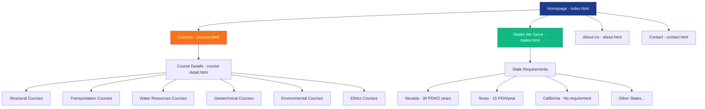
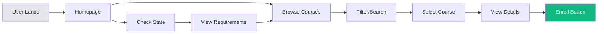

# CivilCE Website Sitemap & Information Architecture

## Visual Sitemap



## Page Hierarchy

### Level 1 - Main Navigation
1. **Homepage** (`index.html`)
   - Hero banner with CTA
   - Featured courses carousel
   - Benefits section
   - State eligibility checker widget
   - Testimonials
   - Newsletter signup

2. **Courses** (`courses.html`)
   - Course catalog grid
   - Filter by category
   - Filter by PDH hours
   - Sort by price/popularity
   - Quick view modals
   - Bundle packages section

3. **States We Serve** (`states.html`)
   - Interactive US map
   - State requirements table
   - Compliance information
   - Certificate acceptance
   - Special emphasis on Nevada

4. **About Us** (`about.html`)
   - Company mission
   - Why choose CivilCE
   - Accreditation badges
   - Team information
   - Quality guarantee

5. **Contact** (`contact.html`)
   - Contact form
   - Support information
   - FAQ accordion
   - Business hours
   - Response time commitment

### Level 2 - Course Details
- Dynamic course detail pages
- Loaded via JavaScript from courses.json
- URL structure: `course-detail.html?id=course-id`

## Navigation Flow



## User Journey Maps

### New User Journey
1. Lands on homepage
2. Checks state eligibility
3. Browses course catalog
4. Views course details
5. Sees pricing
6. Reads about company
7. Contacts for questions
8. Makes enrollment decision

### Returning User Journey
1. Direct to courses page
2. Filters by needed category
3. Selects specific course
4. Reviews details
5. Proceeds to enrollment

## Content Requirements

### Homepage Content Blocks
- **Hero Section**: 
  - Headline: "Advance Your Engineering Career with Quality PDH Courses"
  - Subheadline: "NCEES-Approved Continuing Education for Professional Engineers"
  - CTA: "Browse Courses" / "Check State Requirements"

- **Value Propositions**:
  - ✓ State-Approved PDH Credits
  - ✓ Self-Paced Online Learning
  - ✓ Instant Certificate Delivery
  - ✓ Expert Instructors
  - ✓ 100% Satisfaction Guarantee

- **Featured Courses**: 
  - Display 6 top courses
  - Show PDH hours and price
  - Quick enroll buttons

- **State Checker Widget**:
  - Dropdown to select state
  - Shows requirements instantly
  - Links to full state page

### Footer Structure (All Pages)
```
----------------------------------------
CivilCE Logo | Quick Links | Support | Legal
             | Courses      | Contact | Privacy Policy
             | States       | FAQ     | Terms of Service
             | About        | Help    | Refund Policy
             | Contact      |         | 
----------------------------------------
© 2024 CivilCE | civilce.org | All Rights Reserved
----------------------------------------
```

## Technical Implementation Notes

### File Structure
```
civilce/
├── index.html              # Homepage
├── courses.html            # Course catalog
├── course-detail.html      # Course detail template
├── states.html             # States we serve
├── about.html              # About us
├── contact.html            # Contact page
├── assets/
│   ├── css/
│   │   └── styles.css      # Main stylesheet
│   ├── js/
│   │   └── main.js         # Main JavaScript
│   ├── data/
│   │   └── courses.json    # Course database
│   ├── images/
│   │   ├── logo.svg        # CivilCE logo
│   │   ├── favicon.ico     # Favicon
│   │   └── hero-bg.jpg     # Hero background
│   └── fonts/              # Web fonts (if needed)
├── DEPLOYMENT_GUIDE.md     # Deployment instructions
├── WEBSITE_PLAN.md         # Planning document
├── SITEMAP.md              # This file
└── README.md               # Project documentation
```

### SEO Considerations
- Unique meta titles for each page
- Meta descriptions with keywords
- Structured data for courses (JSON-LD)
- XML sitemap for search engines
- Semantic HTML5 markup
- Alt text for all images
- Fast page load times
- Mobile-first responsive design

### Performance Targets
- Page load time: < 3 seconds
- Lighthouse score: > 90
- Mobile responsive: 100%
- Browser compatibility: Chrome, Firefox, Safari, Edge